# Vue.js入门

## 自我介绍

2016年加入去哪儿网，目前机票事业部前端开发工程师一枚，欢迎交流。

## 主要内容 
* Vue.js介绍
* Vue.js基础语法
* 数据驱动 数据的双向绑定
* 模块化 组件化
* Vue.js的生命周期
* Vue.js的技术栈

## Vue.js介绍

Vue.js是当下很火的一个JavaScript MVVM库，它是以数据驱动和组件化的思想构建的。 
 
Vue.js的作者 Evan You(尤雨溪)，任职于 Google Creative Lab。

 

Vue.js各个版本发布的时间
* 2013.12.24 发布0.7.0
* 2014.01.27 发布0.8.0
* 2014.02.25 发布0.9.0
* 2014.03.24 发布0.10.0
* 2015.10.27 正式发布1.0.0
* 2016.04.27 发布2.0的preview版
* 2016.08.18 正式发布2.0

从0.7.0到0.10.0是一个造轮子的过程；从0.10.0到1.0.0历经一年多，是Vue.js的成长期；1.0.0到2.0是Vue.js学习了其他比较好的东西，例如虚拟DOM等，逐渐走向成熟。

### 回顾MVX模式

在正式进入Vue.js之前，我们先和大家简单回顾一下MVC、MVP和MVVM模式。

#### MVC模式

MVC即Model(模型)、view(视图)和Controller(控制器)的简称。MVC模型 —— 一种将业务逻辑、数据、界面显示分离的方法组织代码的模式。这主要是基于分层的目的，让彼此的职责分开，降低耦合度，便于后期维护。

 

从图可以看到，视图(V)通过控制器(C)和模型(M)进行联系。控制器(C)是模型(M)和视图(V)的协调者，视图(V)和模型(M)不直接联系（View会直接从Model中读取数据）。那么，用户操作应该放在什么位置，MVC之间又会发生什么变化呢？

用户(User)通过控制器(Controller)来操作模型(Model)来达到视图(View)的变化。

#### MVP模式

MVP是从经典的MVC模式演变而来的，他们的思想有相同的地方：Controller/Presenter负责逻辑处理，Model提供数据，View负责显示。

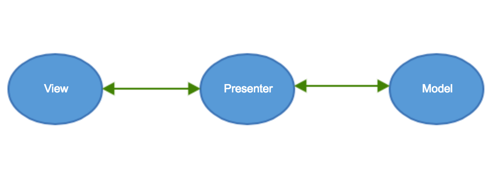 

在MVP中，Presenter完全把View和Model 进行了分离，主要的程序逻辑在Presenter里实现。而且，Presenter与具体的View没有直接关联，而是通过定义好的接口进行交互，从而使得在变更View的时候可以保持Presenter不变。

MVP与MVC有着一个重大的区别：在MVP中View并不直接使用Model，它们之间的通信是通过Presenter (MVC中的Controller)来进行的，所有的交互都发生在Presenter内部，而在MVC中View会直接从Model中读取数据而不是通过 Controller。

#### MVVM模式

MVVM代表的框架： 早期的Knockout、Ember.js 和目前火热来之Google的AgularJS、司徒正美的Avalon，以及我们今天要讲的Vue.js。

相比前两种模式，MVVM只是把MVC中的C和MVP中的P改成了VM。这点有什么变化呢？

 

ViewModel的变化也会自动同步到View上显示，这就是传说中的数据双向绑定。说到数据的双向绑定，AngularJS也是有这个特性的。实际上它们量实现数据双向绑定是不一样的，AngularJS使用的是脏数据检测机制，而Vue.js是通过Object.defineProperty将普通对象转化为带ES5特性之一的getter/setter，具体这里我们就不具体的讲了。

### 与其他技术比较

#### 与AngularJS的区别
同：均支持指令、过滤器、双向绑定，不支持低版本浏览器（IE6/7/8）  
异：  
	1.AngularJS学习成本高，Vue的API简单直观  
	2.数据双向绑定实现方式不同，在性能上得到了很大的优化    
AngularJS双向绑定是对数据进行脏检查，所以watcher越多越慢。而vue.js使用的是基于依赖追踪的观察并且使用异步队列更新，所有的数据都是独立触发。对于庞大的应用来说，这个优化差异还是很明显的。
#### 与React的区别
同：  
    1.均采用特殊的JSX语法，vue.js在组件开发中也推崇编写.vue特殊文件格式，对文件内容都有一些规定，两者都需要编译后使用。  
	2.中心思想相同：一切都是组件，组件之间可以嵌套。  
	3.都提供合理的钩子函数，可以让开发者定制化地处理需求  
	4.都不内置类似Ajax,router等功能的核心包，而是以插件的方式加载  
异：  
	1.React依赖 虚拟Dom, 而Vue.js使用的是DOM模板（vue.js 2.0也支持了虚拟DOM，但两者是有差异的）  
	2.Vue.js在模板中提供指令、过滤器等，可以更翻遍快捷地操作DOM
#### 与Backbone.js的区别
定位不同，Vue.js专注于View,而Backbone除view之外，还提供Collection、model和Router。Vue.js拥有数据双向绑定，而Backbone需要手动通过事件来操作DOM。

## Vue.js核心特点
* MVVM模式
* 数据驱动 数据双向绑定
* 模块化 组件化

## 基础语法
了解一门语言或者学习一门新技术，编写Hello World示例是我们的必经之路。 
首先我们在一个html文件中，直接通过script标签引入Vue.js，然后在页面里写Vue.js代码的方式来演示Vue.js的基础语法。 

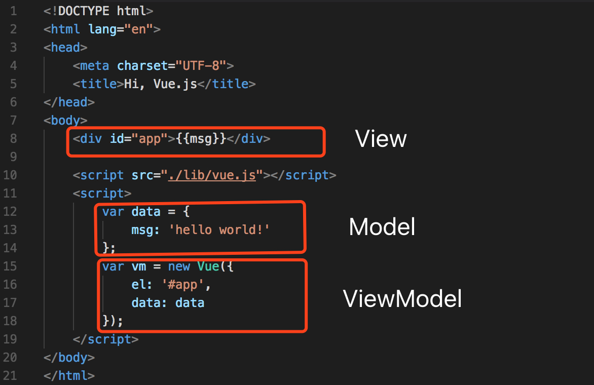

使用Vue的过程就是定义MVVM各个组成部分的过程的过程，即定义模板（View），定义数据（Model）和定义Vue实例（ViewModel），ViewModel选项对象的el属性执行View，data指向Model。

这里我们看到的只是一个最简易的Vue使用，它还有其他的基础语法，它们包括数据绑定、指令、计算属性、过滤器、样式&过渡等，下面我们来一一介绍。
### 数据绑定
 Vue.js数据的绑定有多种，上面helloWorld中我们看到了类似Mustach的插值（使用{{}}），除此之外，Vue.js中还可使用指令和表达式，下面我们看看这个栗子。
 

 运行页面结果：

 

### 指令
数据绑定中我们初步认识到了指令，那么Vue.js中的指令究竟是什么呢？他和AngularJS中的指令有什么区别?

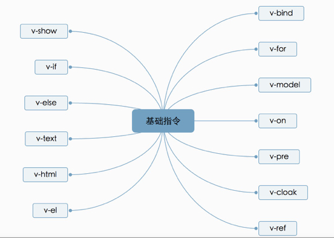
* v-show / v-if   是否展示 (区别：v-show不展示时，是有Dom占位的，而v-if直接没有不显示的节点。)
* v-text / v-html  显示普通文/HTML内容文本
* v-model  表单绑定
* v-bind  元素属性
* v-for  循环（list列表）
* v-on 事件（click等，click.stop 阻止时间冒泡） 
* ...

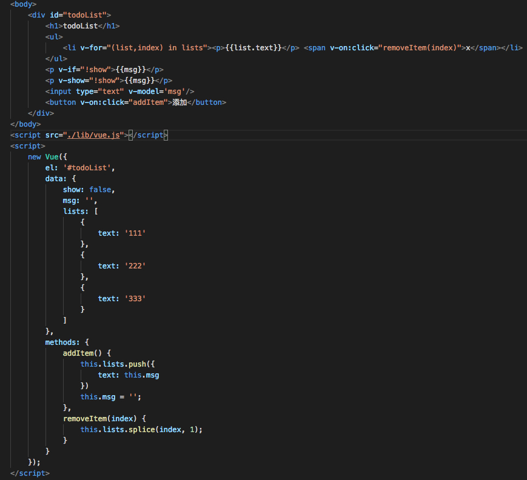

运行页面结果：

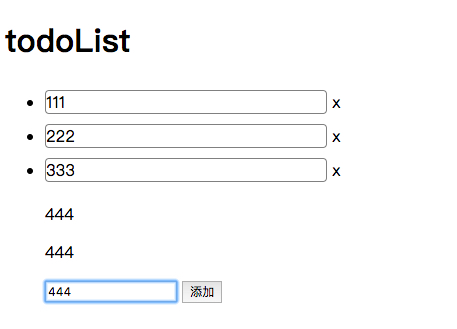

自定义指令：

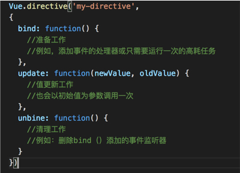

同Angular一样，Vue.js提供了几个钩子函数（都是可选的，相互之间没有制约关系）——bind  upadte unbind

bind——只调用一次，在指令第一次绑定到元素上是调用
update——在bind之后立即以初始值为参数第一次调用，之后每当绑定值变化时调用，参数为新值与旧值
unbind——只调用一次，在指令从元素上解绑时调用

注册之后，便可以在模板中这样用（记着添加前缀v-）

### 计算属性
什么是计算属性？当其依赖属性的值发生改变时，这个属性的值会自动更新，与之相关的DOM部分也会同步更新。

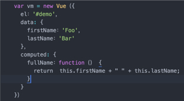

data影响计算属性的数据，没有发生改变的时候，多次访问fullName都不会再重新执行计算的这个属性(依赖缓存)

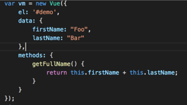

methods也能实现（每次被重新渲染的时候都会被重新调用）

计算属性：与方法不同，它们不接受任何参数，但它们具有对现有状态的访问权限。 它们是为了执行性能和跟踪/缓存它们自己的依赖而建立的，因此它们非常适合于从您的状态创建派生数据。

方法：与计算属性不同，方法可以接受参数，但是，该方法将不会跟踪其依赖关系或缓存传递给它的任何数据。
### 过滤器
Vue.js提供了一些内置的过滤器，用于数据过滤、筛选等。

字母过滤器：
* capitalize 首字母大写       
* uppercase  字符中所有的字符大写             
* lowercase  字符中所有的字符小写

限制过滤器:
* limitBy  限制数组为开始的前N个元素,其中N为传入的第一个参数指定。第二个参数（偏移量,从哪个元素开始）可选，默认为0
* filterBy 限制比较灵活，参数可谓字符串或者函数
* orderBy 返回排序后的数组，条件可是字符串、数组和函数

json —— 打印格式处理  
currency —— 数字转化未带货币符号形式  
debounce —— 延迟处理器一定的时间执行

可自定义过滤器：

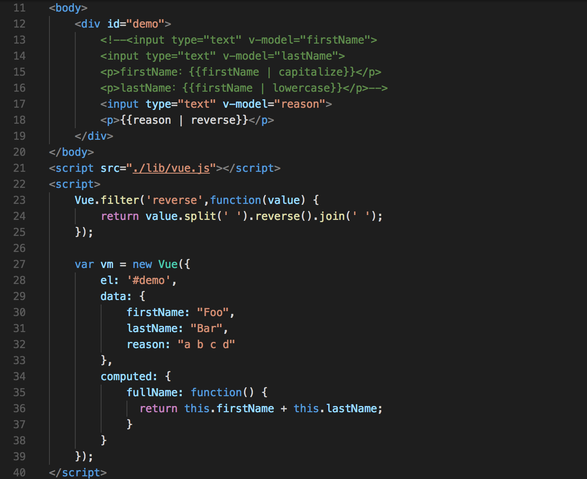

从上图栗子可以看到自定义一个过滤器Vue.filter('', Fn),过滤器的本质是函数，起作用在于用户输入数据后，它能够进行处理，并返回一个数据结果。过滤器使用管道符（|）进行连接。
### 样式&过渡
这块不知道咋讲，直接上栗子吧！
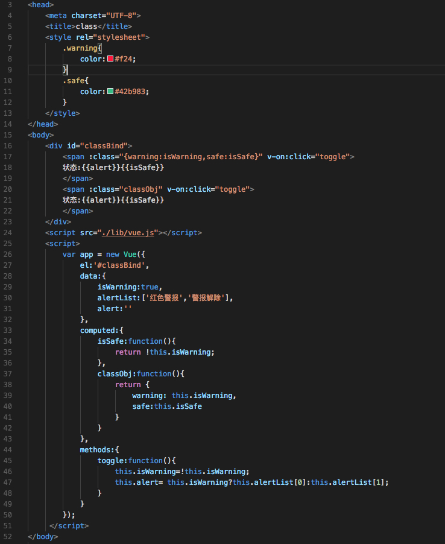

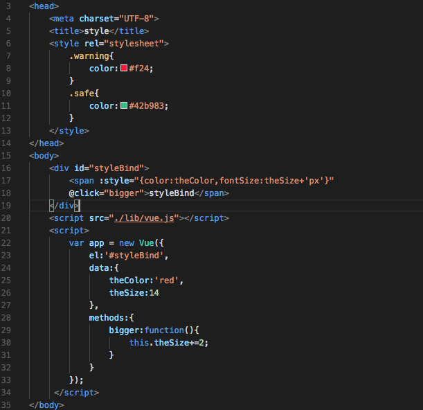

过渡分为css过渡和JavaScript过渡，这里我就不讲了，有兴趣的同学可以自己下来看看！
## 数据驱动&数据双向绑定
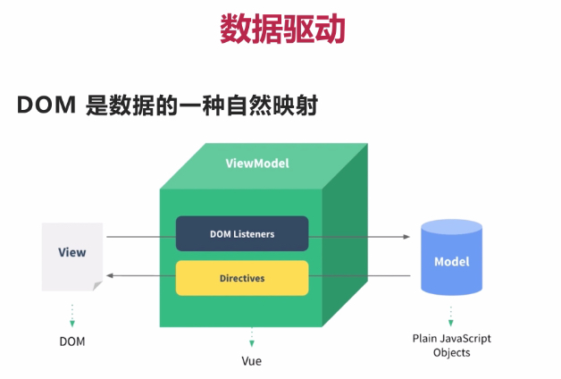

ViewModel是Vue.js的核心，它是一个Vue实例。Vue实例是作用于某一个HTML元素上的，这个元素可以是HTML的body元素，也可以是指定了id的某个元素。

当创建了ViewModel后，双向绑定是如何达成的呢？

首先，我们将上图中的DOM Listeners和Data Bindings看作两个工具(View层（即DOM层）与Model层（即JS逻辑层）之间通过ViewModel绑定了DOM Listeners与Data Bindings两个相当于监听器的东西)，它们是实现双向绑定的关键。
从View侧看，ViewModel中的DOM Listeners工具会帮我们监测页面上DOM元素的变化，如果有变化，则更改Model中的数据；
从Model侧看，当我们更新Model中的数据时，Data Bindings工具（指令）会帮我们更新页面中的DOM元素。

这样便实现了一个双向数据绑定的功能，也是Vue.js数据驱动的原理所在。

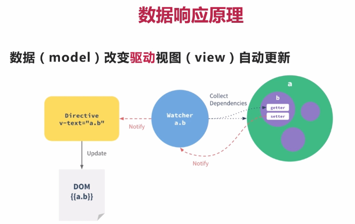

Vue.js将普通的对象的属性通过Object.defineProperty转换为ES5特性之一的 getter/setter，模板中每个指令/数据绑定都有一个对应的 watcher 对象。
当修改对象值的时，首先会触发属性的setter，在setter被调用时，会触发 watcher 重新计算，也就会导致它的关联指令更新DOM。

## 模块化&组件化
在大型的应用中，为了分工、复用和可维护性，我们不可避免地需要将应用抽象为多个相对独立的模块。在较为传统的开发模式中，我们只有在考虑复用时才会将某一部分做成组件；但实际上，应用类 UI 完全可以看作是全部由组件树构成的：

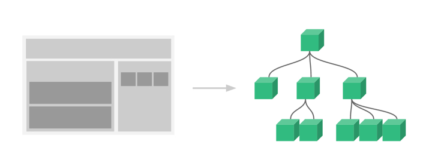

因此，在Vue.js的设计中将组件作为一个核心概念。可以说，每一个Vue.js应用都是围绕着组件来开发的。

那么如何定义一个组件呢？
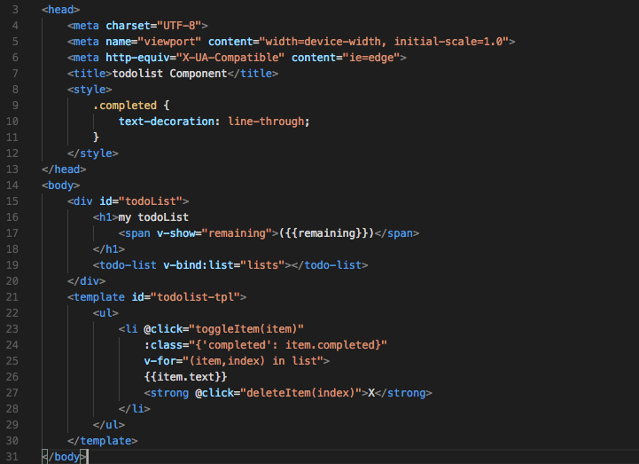
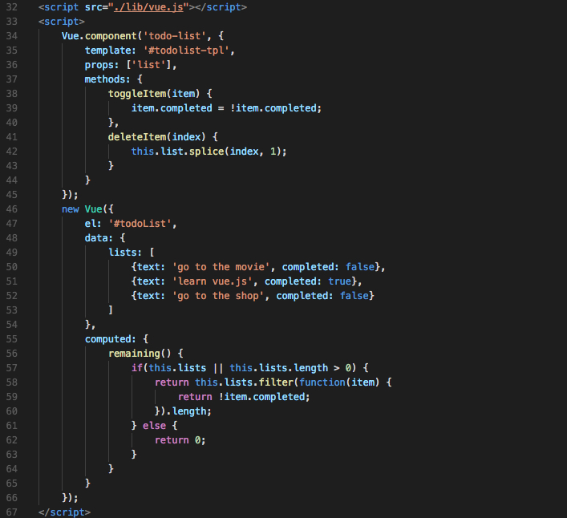

运行结果

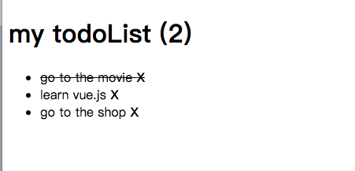

从上面的栗子我们可以看到，注册组件：
Vue.component('xxx-xxx',options);
组件选项options包括:
* 模板（template）
* 初始数据（data）
* 接受外部参数（props）
* 方法（methods）
* 生命周期钩子函数（created等）

使用

`<xxx-xxx></xxx-xxx>`

## Vue.js的生命周期

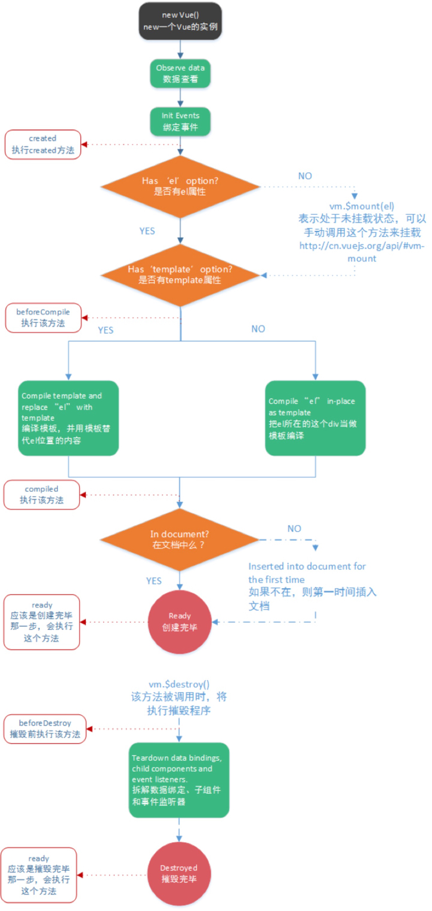

生命周期可对照栗子看！见[生命周期栗子](src/lifeCycle.html)

## Vue.js技术栈
以上我们讲到可以直接在一个html页面里通过引入Vue.js来直接写Vue代码，但是这样的方式并不常用。因为如果我们的项目比较大，项目中会存在很多页面，一旦每个页面都引入一个Vue.js或者声明一个Vue实例，这样非常不利于后期的维护和代码的公用，也会存在实例名冲突的情况，所以我们需要用到Vue提供的技术栈来构建强大的前端项目。

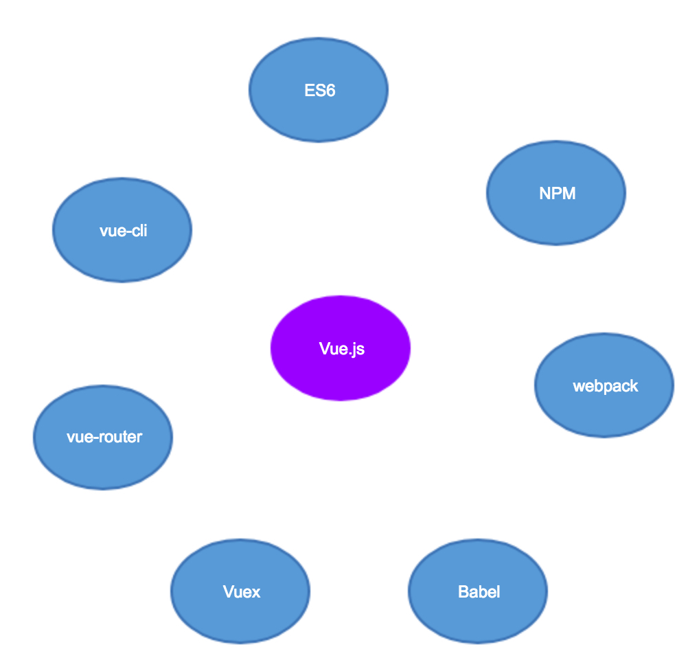

使用脚手架搭建工程步骤

## 为什么分享/使用 Vue.js ?

1.学习成本不高，API简单让业务代码更好的组织    
    
    template + 数据双向绑定 + 组件  
2.解决了前端交互复杂带来的性能问题  
3.完整的开发生态链
从脚手架、构建、插件化、组件化，到编辑器工具、浏览器插件等，基本覆盖了从开发到测试的多个环节。
## 总结
以上我们从介绍了Vue.js的发展史，Vue.js与其他技术比较，基本语法，基本特征MVVM模型、数据双向绑定、模块化和组件化，以及构建一个强大的前端项目需要的技术栈。我们基本掌握了Vue.js的基础知识，了解了其基本特征，有兴趣的同学可以进一步的学习和探寻。
